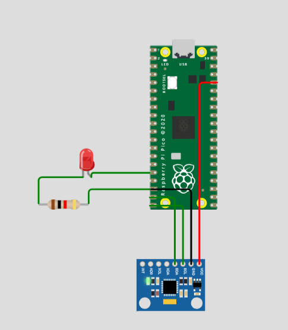
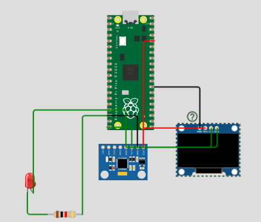
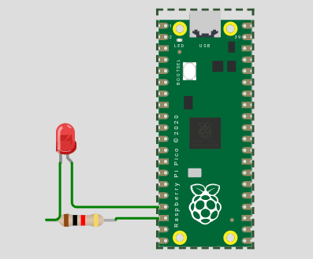
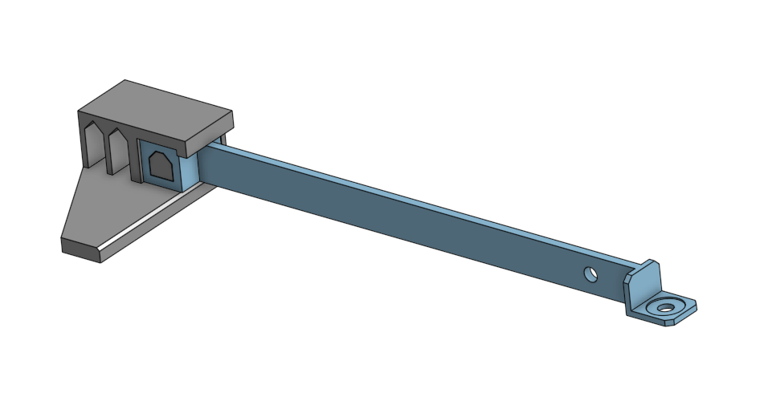

# Engineering_4_Notebook

&nbsp;

## Table of Contents
* [Raspberry_Pi_Assignment_Template](#raspberry_pi_assignment_template)
* [Onshape_Assignment_Template](#onshape_assignment_template)

&nbsp;

## Launch Pad Part 1

### Assignment Description

the assignment was to get a serial moniter to print a countdown from 10 to 0 then print lift off at 0. It was to mimic a rocket launch.

### Evidence 

)

### Wiring

N/A

### Code
[simple countdown code](https://github.com/Graham913/Engineering_4_Notebook/blob/main/raspberry-pi/countdown1.py)

### Reflection

For the first assignment that we did it was very simple. for x in range sets the parameters of the countdown. Make sure your if elsestatement is entirely inside the for x in range.

## Launch Pad Part 2 (lights)

### Assignment description

The assignment was to take the previous code of the countdown and add lights. Every time it counts down one the red LED blinks and when the countdown reaches 0 it blinks green.

### Evidence
)
### Wiring 

  

### Code
[LED countdown code](https://github.com/Graham913/Engineering_4_Notebook/blob/main/raspberry-pi/countdown.py)
### Reflection

This assignment was quite easy, remember if else statements are good for countdowns that have two things that you want it to do. Make sure to use two equal signs in your if then statements as well as double checking if you have colons in the right places. My code didn't work until I put While True: pass in it so if your code doesn't work try that.

## Launch Pad Part 3 (button)

### Assignment description

The assignment was to Have the entire previous assignment to start with the push of a button.

### Evidence

### Wiring

### Code
[LED button countdown code](https://github.com/Graham913/Engineering_4_Notebook/blob/main/raspberry-pi/button.py)
### Reflection

This was a simple change from the previous code. Make sure to have the defining lines of code for the button in the right place. Make sure to have the button value have two equal signs as well as have it encompass the entire if then statement.

## Launch Pad Part 4 (servo)

### Assignment description

The assignment was to have everything that the previous assignment has but to have a 180 degree servo activate during liftoff to simulate the launch tower dissconnecting from the rocket.

### Evidence

### Wiring
 
### Code
[LED servo countdown code](https://github.com/Graham913/Engineering_4_Notebook/blob/main/raspberry-pi/servo.py)

### Reflection
This assignment was relatively easy, make sure that your servo actually works before taking it I learned this the hard way. Set it to 0 degrees before turning it to 180. Color code your wiring according to the colors on the servo itll make it easier.

## Crash Avoidance Part 1

### Assignment Description
Have an accelerometer that continuously reports x, y, and z acceleration values on the serial monitor.

### Evidence

### Wiring
 

### Code
[Crash1 code](https://github.com/Graham913/Engineering_4_Notebook/blob/main/crash1.py)

### Reflection
This assignment was a big step from the countdowns. Make sure to slowly read the entire assignment becuase it is very easy to miss something small that could complete the code. Make sure to research f strings as well becuase this was the first time I used them and they were very confusing without looking them up.

## Crash Avoidance Part 2

### Assignment Description
Have an accelerometer that continuously reports x, y, and z acceleration values on the serial monitor and when the module moves to 90 degrees have an LED turn on as well as be powered by a battery.

### Evidence

### Wiring
 

### Code
[Crash2 code](https://github.com/Graham913/Engineering_4_Notebook/blob/main/crash2.py)

### Reflection
This isn't too big of a step from crash1. It introduces the if or statement which is for each plane going to 90 degrees. Read carefully when you type it and double check the intergers are right.

## Crash Avoidance Part 3

### Assignment Description
Have everything that you had from the previous assignment as well as an onboard screen that prints x, y, and z angular velocity values (rad/s) rounded to 3 decimal places.

### Evidence

### Wiring
 
### Code
[Crash3 code](https://github.com/Graham913/Engineering_4_Notebook/blob/main/crash3.py)
### Reflection
This assignment was probably the one I was most confused on. Make sure to triple check your wiring and have different colors for different things or it will be easy to get confused. Read the assignment carefully becuase a lot of the defines and hints are on there and they are really helpful.
## Landing Area Part 1

### Assignment Description
The code must ask the user to input 3 coordinates and, using a function, find the area and print the area in the terminal like so-The area of the triangle with vertices (x,y), (x,y), (x,y) is {area} square km
### Evidence

### Wiring
N/A
### Code 
[Landing Area 1 code](https://github.com/Graham913/Engineering_4_Notebook/blob/main/landingarea.py)
### Reflection
Writing the function of this assignment was probably the hardest part. Make sure the keep track of each x and y coordinate as well as make sure that the parantheses are correct. Make sure to call the function after you define it. 
## Landing Area Part 2

### Assignment Description
Everything from the previous assignment but have it plot the triangle on a coordinate plane on the OLED screen.
### Evidence

### Wiring
 
### Code 
[Landing Area 2 code](https://github.com/Graham913/Engineering_4_Notebook/blob/main/landingarea2)
### Reflection
There were a lot of imports in this assignment make sure you have everything from the adafruit library on your D drive. This assignment is pretty much smooshing the previous assignments together in terms of code from the OLED screen. The screen thinks the origin is in the upper left corner so make sure to add 64 for x and 32 for y.
## Morse Code Part 1

### Assignment Description
Write code to translate user input into morse code.
### Evidence

### Wiring
N/A
### Code 
[Morse Code Part 1 code](https://github.com/Graham913/Engineering_4_Notebook/blob/main/morse1.py)
### Reflection
THe entire dictionary you need is on the assignment. You can name your variable anything but make it easy to remember. Make sure to have the if break command before you convert the message to upper case or it wont work.
## Morse Code Part 2

### Assignment Description
everything from the previous morse code assignment but have an led blink in morse code what you translate.
### Evidence

### Wiring
 
 
### Code 
[Morse Code Part 2 code](https://github.com/Graham913/Engineering_4_Notebook/blob/main/morse2.py)
### Reflection
As the final Pico assignment it wasn't difficult at all. For your new variable I recommend making it have something in common with the other variable that you already had from the previous assignment. Double chedck colons at the end of the for and if commands. Make sure to put time.sleep(between_taps) even after the led is turned off.

&nbsp;

## Beam Part 1

### Assignment Description

Design a beam with the goal of maximizing weight beofre failure. it cannot bend more than 35mm.

### Part Link 

https://cvilleschools.onshape.com/documents/54cd02e8213ad47e874c9d63/w/f8672ff7eef13254d9215e03/e/a046d286a6beaf0e9828b68b?aa=true

### Part Image

 
### Reflection

We decided that a vertical beam would much much stronger. We reduced weight by chamfering the end where the bucket would be attached. We cut a hole in the beam near the end to reduce weight and since its near the downward force the stress would be less.

## Beam Part 2

### Assignment Description

Run one static finite element analysis on your beam to determine what areas need to be improved.

### Part Link 

https://cvilleschools.onshape.com/documents/54cd02e8213ad47e874c9d63/w/f8672ff7eef13254d9215e03/e/74dd8de3097cb51ce76834c9

### Part Image

 

### Reflection

After running the simulation we determined that the place of most stressed was close to where the base of the beam is. We managed to chamfer off a little more from the other end of them beam and added supported on each side. Putting holes in the beam near where the bucket is held doesnt take off much stress but takes off weight. 

&nbsp;

## Media Test

Your readme will have various images and gifs on it. Upload a test image and test gif to make sure you've got the process figured out. Pick whatever image and gif you want!

### Test Link
Rx-7 side view and Dana White going crazy
### Test Image
  
### Test GIF
  
