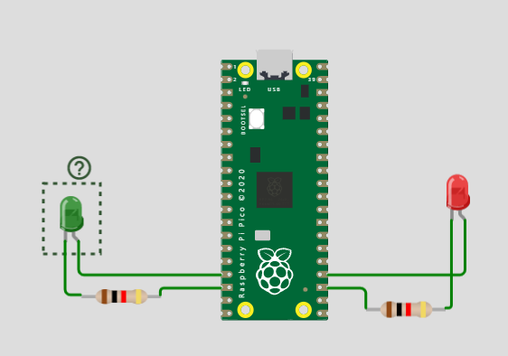
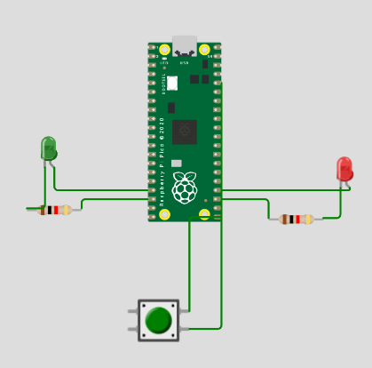
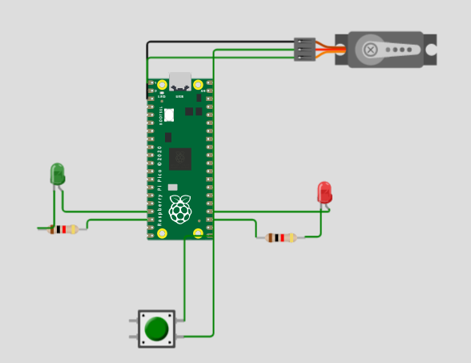
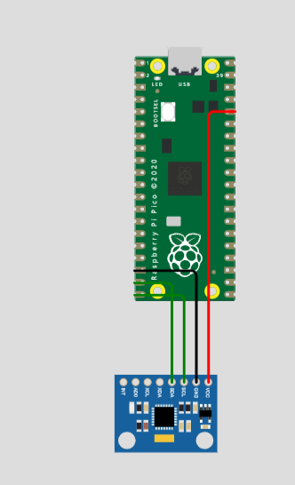

# Engineering_4_Notebook

&nbsp;

## Table of Contents
* [Raspberry_Pi_Assignment_Template](#raspberry_pi_assignment_template)
* [Onshape_Assignment_Template](#onshape_assignment_template)

&nbsp;

## Launch Pad Part 1

### Assignment Description

the assignment was to get a serial moniter to print a countdown from 10 to 0 then print lift off at 0. It was to mimic a rocket launch.

### Evidence 

)

### Wiring

N/A

### Code
[simple countdown code](https://github.com/Graham913/Engineering_4_Notebook/blob/main/raspberry-pi/countdown1.py)

### Reflection

For the first assignment that we did it was very simple. for x in range sets the parameters of the countdown. Make sure your if elsestatement is entirely inside the for x in range.

## Launch Pad Part 2 (lights)

### Assignment description

The assignment was to take the previous code of the countdown and add lights. Every time it counts down one the red LED blinks and when the countdown reaches 0 it blinks green.

### Evidence
)
### Wiring 

  

### Code
[LED countdown code](https://github.com/Graham913/Engineering_4_Notebook/blob/main/raspberry-pi/countdown.py)
### Reflection

This assignment was quite easy, remember if else statements are good for countdowns that have two things that you want it to do. Make sure to use two equal signs in your if then statements as well as double checking if you have colons in the right places. My code didn't work until I put While True: pass in it so if your code doesn't work try that.

## Launch Pad Part 3 (button)

### Assignment description

The assignment was to Have the entire previous assignment to start with the push of a button.

### Evidence

### Wiring

### Code
[LED button countdown code](https://github.com/Graham913/Engineering_4_Notebook/blob/main/raspberry-pi/button.py)
### Reflection

This was a simple change from the previous code. Make sure to have the defining lines of code for the button in the right place. Make sure to have the button value have two equal signs as well as have it encompass the entire if then statement.

## Launch Pad Part 4 (servo)

### Assignment description

The assignment was to have everything that the previous assignment has but to have a 180 degree servo activate during liftoff to simulate the launch tower dissconnecting from the rocket.

### Evidence

### Wiring
 
### Code
[LED servo countdown code](https://github.com/Graham913/Engineering_4_Notebook/blob/main/raspberry-pi/servo.py)

## Crash Avoidance Part 1

### Assignment Description
Have an accelerometer that continuously reports x, y, and z acceleration values on the serial monitor.

### Evidence

### Wiring
 

### Code
[Crash1 code](https://github.com/Graham913/Engineering_4_Notebook/blob/main/crash1.py)

&nbsp;

## Onshape_Assignment_Template

### Assignment Description

Write your assignment description here. What is the purpose of this assignment? It should be at least a few sentences.

### Part Link 

[Create a link to your Onshape document](https://cvilleschools.onshape.com/documents/003e413cee57f7ccccaa15c2/w/ea71050bb283bf3bf088c96c/e/c85ae532263d3b551e1795d0?renderMode=0&uiState=62d9b9d7883c4f335ec42021). Don't forget to turn on link sharing in your Onshape document so that others can see it. 

### Part Image

Take a nice screenshot of your Onshape document. 

### Reflection

What went wrong / was challenging, how'd you figure it out, and what did you learn from that experience? Your goal for the reflection is to pass on knowledge that will make this assignment better or easier for the next person. Think about your audience for this one, which may be "future you" (when you realize you need some of this code in three months), me, or your college admission committee!

&nbsp;

## Media Test

Your readme will have various images and gifs on it. Upload a test image and test gif to make sure you've got the process figured out. Pick whatever image and gif you want!

### Test Link
Rx-7 side view and Dana White going crazy
### Test Image
  
### Test GIF
  
